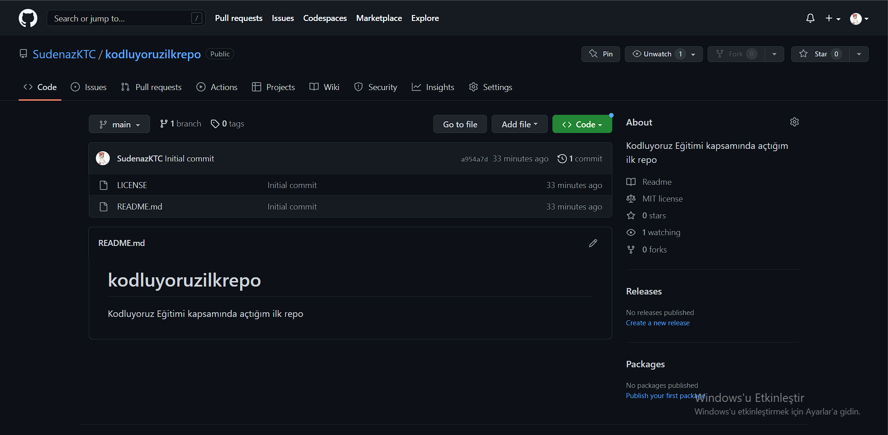

# Kodluyoruz Ilk Repo
---
Bu repo [Kodluyoruz](https://kodluyoruz.org/tr/kodluyoruz/) Front-End Eğitiminde oluşturduğumuz ilk repo. İçerisinde bir adet README dosyası, bir adet de index.html barındırıyor.



## Kurulum 
---
Öncelikle projeyi clonelayın. (Buraya sizin reponuzdan aldığınız link gelecek)

```bash
git clone https://github.com/SudenazKTC/kodluyoruzilkrepo.git
```


## Kullanım
---
Projeyi cloneladıktan sonra Visual Studio Code programında açınız.

## Contributing
---
Pull requestler kabul edilir. Büyük değişiklikler için, lütfen önce neyi değiştirmek istediğinizi tartışmak için bir konu açınız


[Patika](https://www.patika.dev)